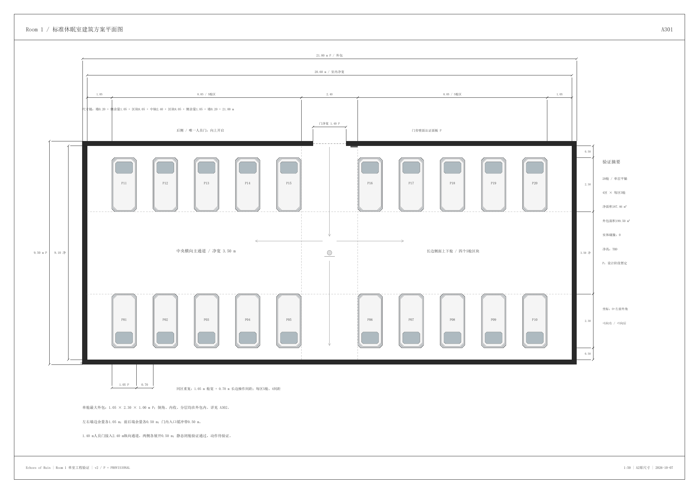
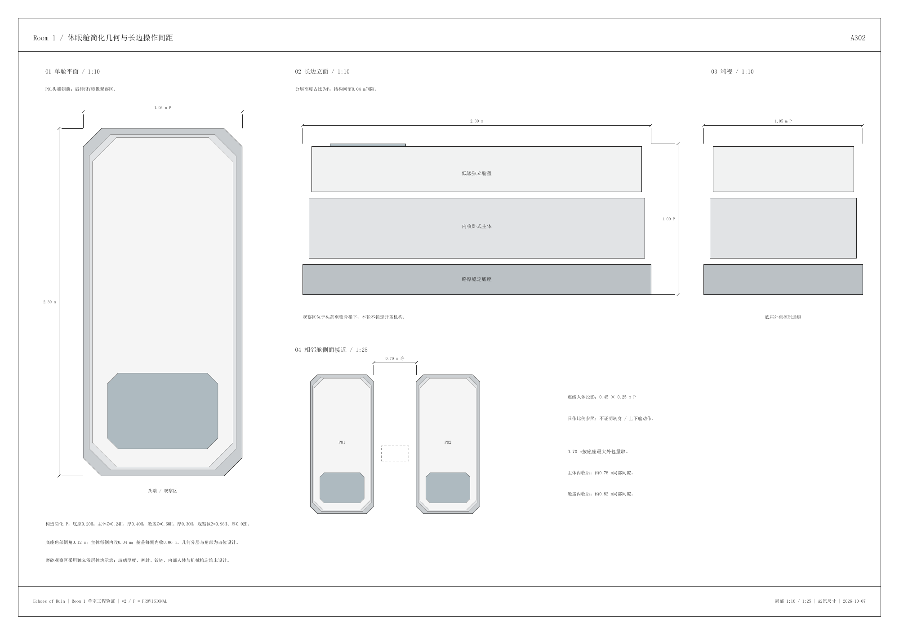
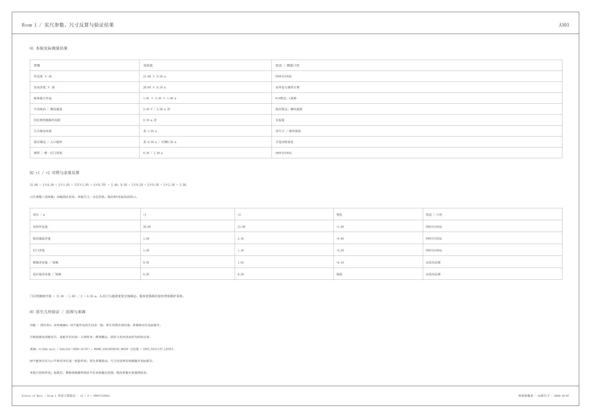
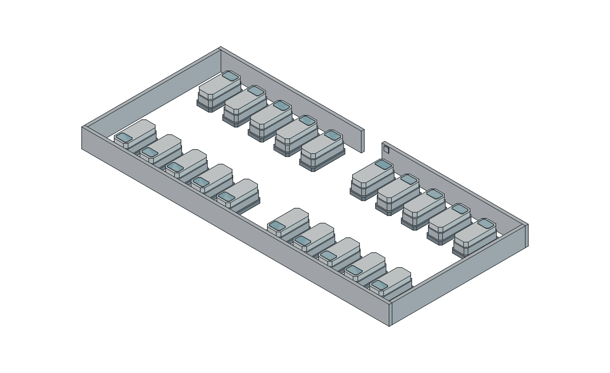

# Room 1 工程图与空间验证

当前交付：**v2 / 2026-10-07 / PROVISIONAL，待设计审阅**。

已依据[工程简报](ROOM1_ENGINEERING_BRIEF.md)提交`6ddc2ddf2eac0eef5aecc959120a24d041afe7da`完成v2。仅将房间外包宽20.00→21.00 m、中央纵向通道1.60→2.40 m、后墙人员门1.60→1.40 m。房间深度9.50 m、20舱四区各5、舱体分层形状、3.50 m横向通道与0.70 m舱间距沿用v1。

室内净尺寸20.60×9.10 m；左右墙边余量各1.05 m，前后各0.50 m。居中的1.40 m门洞与2.40 m纵向通道之间两侧各展开0.50 m。

- [FreeCAD 可编辑源文件](v2/room1_engineering_v2.FCStd)
- [A2三页工程图 PDF](v2/exports/room1_engineering_v2.pdf)
- [完整交付 ZIP](v2/room1_engineering_v2_delivery.zip)
- [参数、v1对照、范围与再生成说明](v2/README.md)
- [全部参数与验证 JSON](v2/cad_validation.json)
- [GUI原生尺寸与七项参数联动](v2/qa/gui_validation.json)
- [保存后独立回读与舱体几何对照](v2/qa/saved_validation.json)
- [文件哈希清单](v2/manifest.json)

89个全约束草图、86个有效实体，正体积实体碰撞0。对照v1，只有上述三项输入参数改变；80个舱体分层平移对齐后形状一致，v1源文件保留。

**验证边界：**仅验证静态闭舱几何。开盖扫掠、人体转身/上下舱、辅助操作、搬运更换、消防机电与室内净高仍待验证。3D图中1.3 m墙高为剖切显示值。本版尺寸为设计测试值，未扩展标准层、整栋楼或园区。

## 总平面 A301

## 单舱分层 A302

## v1 / v2 尺寸对照 A303

## 原生实体轴测

## 历史版本

- [v1说明与实尺验证](v1/README.md)：20.00×9.50 m外包，纵向通道1.60 m，后门1.60 m。
- [v1 FreeCAD](v1/room1_engineering_v1.FCStd)、[v1 PDF](v1/exports/room1_engineering_v1.pdf)、[v1 ZIP](v1/room1_engineering_v1_delivery.zip)。
