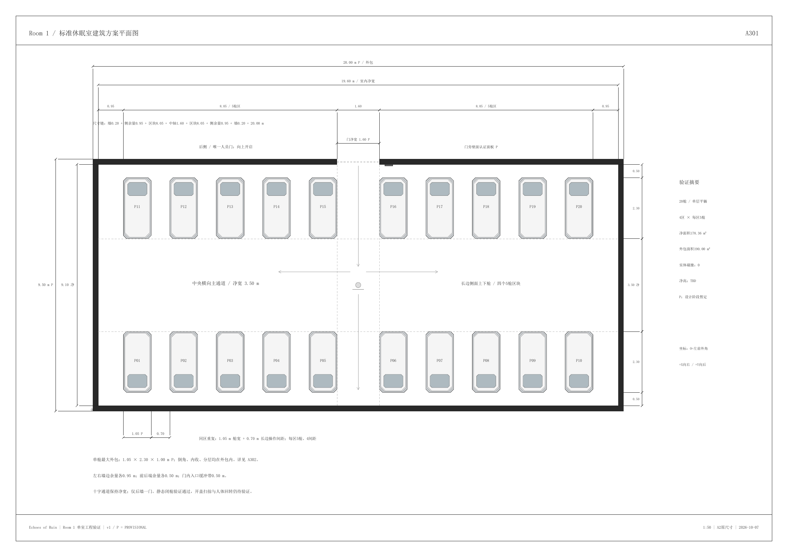
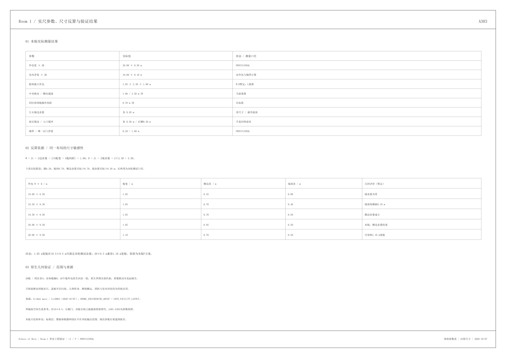
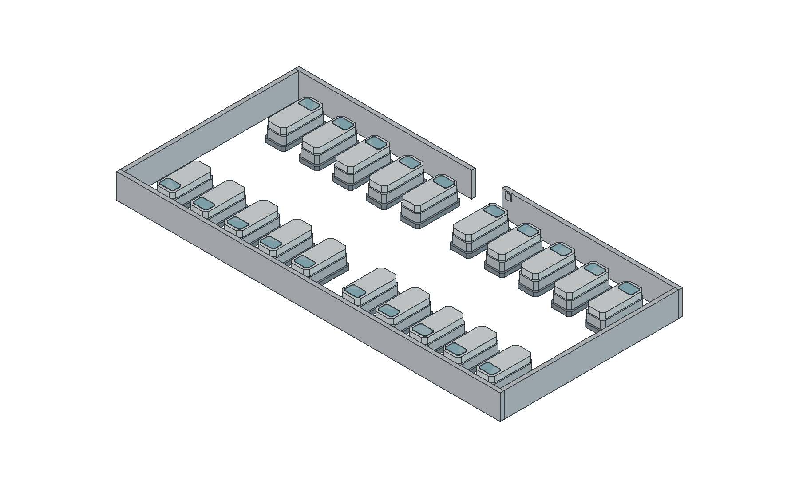

# Room 1 工程图与空间验证

当前交付：**v1 / 2026-10-07 / PROVISIONAL，待审阅**。

已依据最新[工程简报](ROOM1_ENGINEERING_BRIEF.md)及简化舱体修订 `fcc0863` 完成单室实尺排布。采用20.00×9.50 m外包，室内净尺寸19.60×9.10 m；20舱，四区各5，后墙中央唯一人员门；纵向通道1.60 m、横向通道3.50 m、相邻舱长边间距0.70 m。左右墙边余量各0.95 m，前后各0.50 m。

- [FreeCAD 可编辑源文件](v1/room1_engineering_v1.FCStd)
- [A2三页工程图 PDF](v1/exports/room1_engineering_v1.pdf)
- [完整交付 ZIP](v1/room1_engineering_v1_delivery.zip)
- [参数、反算、范围与再生成说明](v1/README.md)
- [全部参数与验证 JSON](v1/cad_validation.json)
- [GUI原生尺寸与参数联动](v1/qa/gui_validation.json)
- [保存后独立回读](v1/qa/saved_validation.json)
- [文件哈希清单](v1/manifest.json)

89个全约束草图、86个有效实体，原生尺寸回读与五项参数联动通过，正体积实体碰撞0。休眠舱保留底座、内收主体、独立低盖和头部观察区，所有分层受1.05×2.30×1.00 m最大外包约束。

**验证边界：**只验证静态闭舱几何。开盖扫掠、人体转身/上下舱、辅助操作、搬运更换、消防机电与室内净高仍待验证。3D图中1.3 m墙高只是剖切显示值。未扩展标准层、整栋楼或园区。

## 总平面 A301

## 单舱分层 A302

## 尺寸反算 A303

## 原生实体轴测

